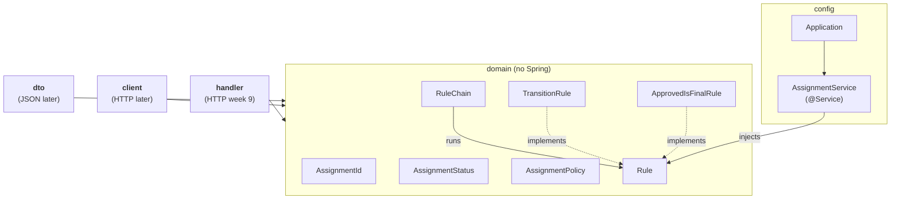

# Product

This project is a simple web-based system for managing homework assignments.
It allows teachers and students to follow the progress of an assignment from
the moment it is assigned until it is finally approved.

# Core item

The main entity of this project is an **Assignment**.
Each assignment has a unique identifier and a status that shows its current
stage in the homework process.

# Status table

| From | To | Allowed? | Business reason |
|------|----|----------|-----------------|
| ASSIGNED | SUBMITTED | Yes | The student submits the assigned homework. |
| SUBMITTED | CHECKED | Yes | The teacher checks the submitted homework. |
| CHECKED | ASSIGNED | No | A checked assignment cannot return directly to the initial state. |
| APPROVED | SUBMITTED | No | An approved assignment is already completed and cannot be submitted again. |

# Forbidden transitions

## CHECKED → ASSIGNED

This transition is not allowed because the assignment has already been checked.
Sending it back to the **ASSIGNED** state would break the normal order of the
homework process.

## APPROVED → SUBMITTED

This transition is also not allowed because an approved assignment is already
finished. Once it is approved, it cannot be submitted again.

# Rules

The transition logic lives in small `Rule` implementations (plain Java, no Spring).
`RuleChain` runs them in order and stops at the first failure.

| Rule | Enforces | Status table rows |
|------|----------|-------------------|
| ApprovedIsFinalRule | Stop-factor: an approved assignment is finished | APPROVED → SUBMITTED (No) |
| TransitionRule | Only the listed transitions are allowed | ASSIGNED → SUBMITTED, SUBMITTED → CHECKED, CHECKED → APPROVED (Yes); CHECKED → ASSIGNED (No) |

#Architecture

Arrows point inward, and `domain` never imports `org.springframework`.